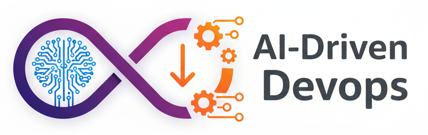
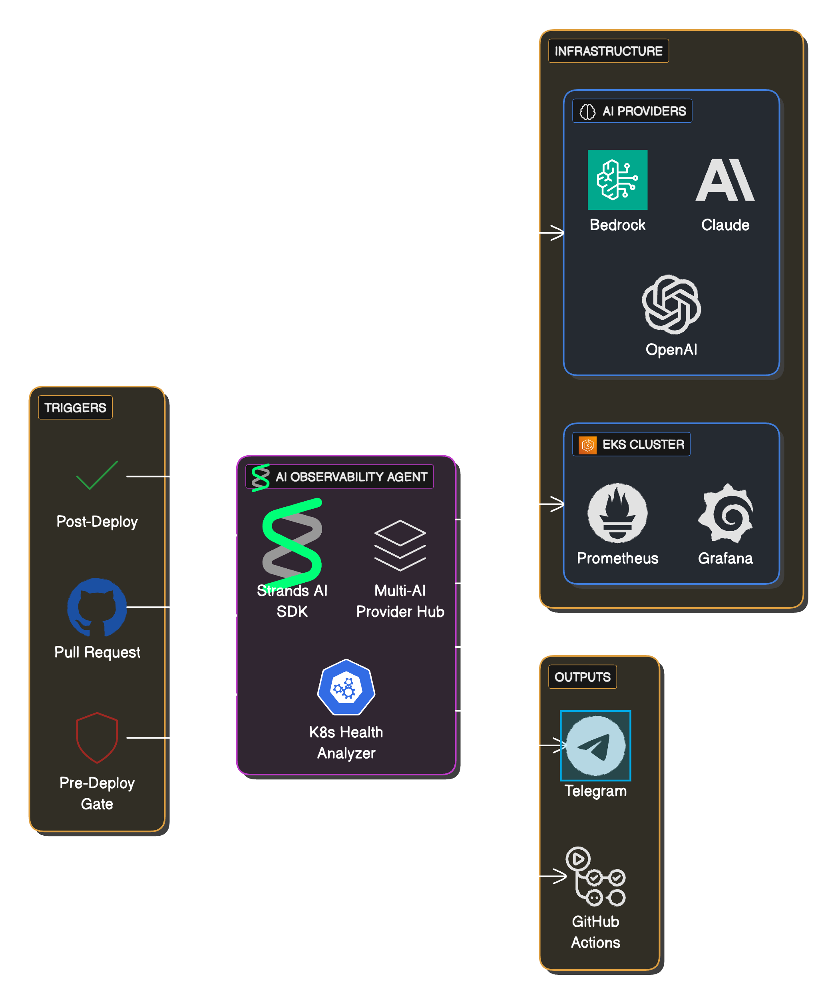
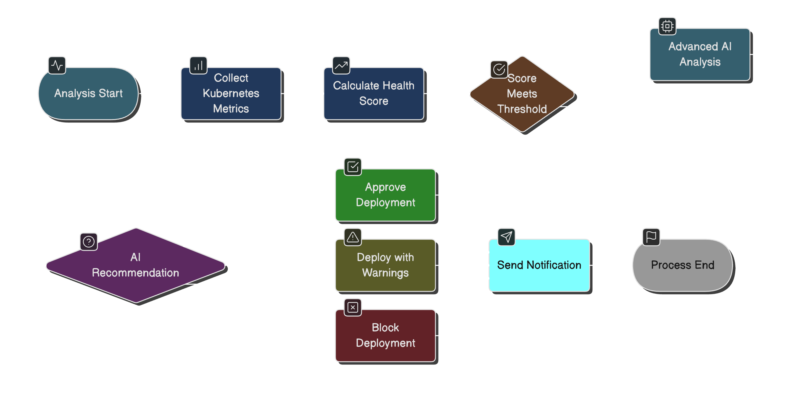
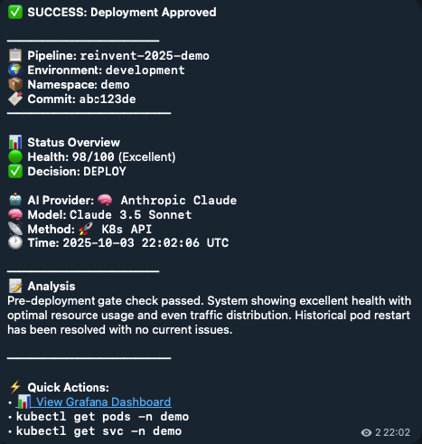
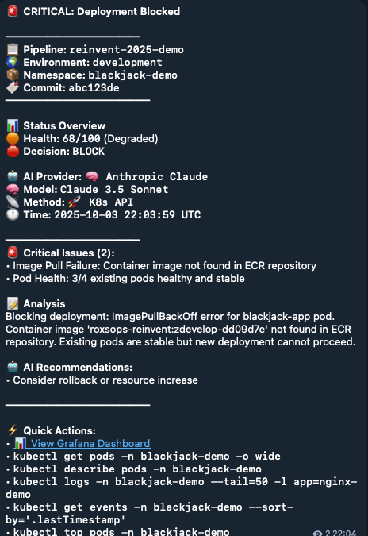
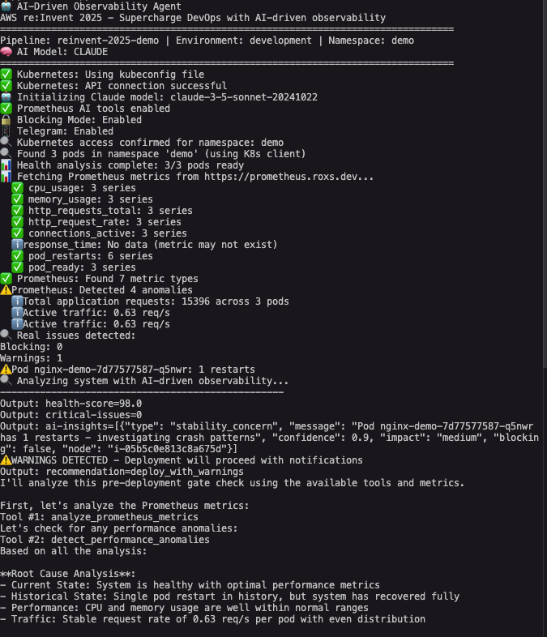
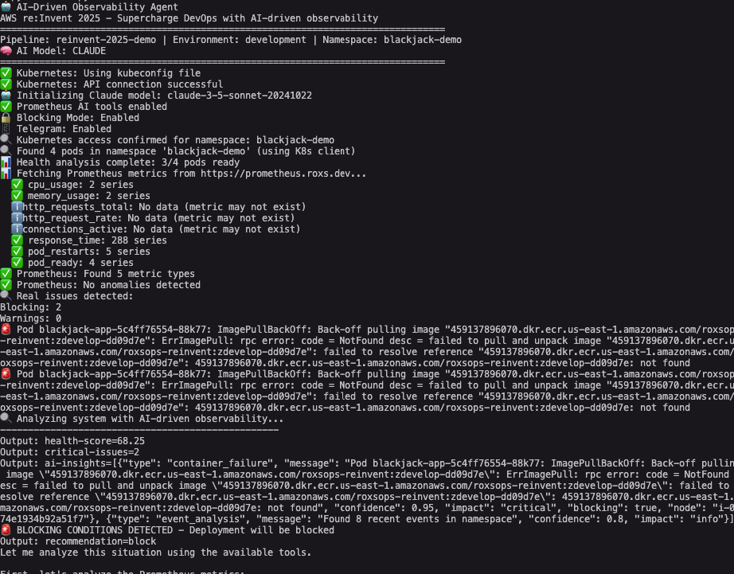
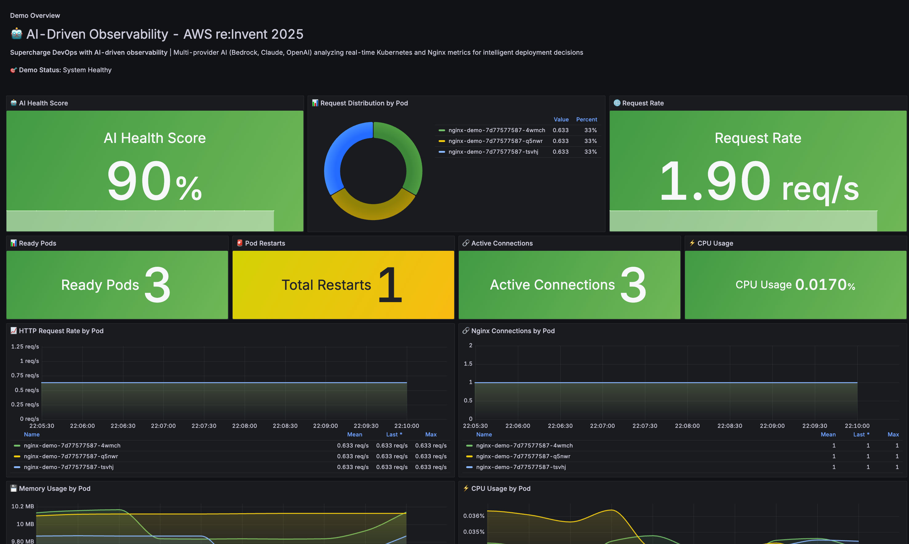
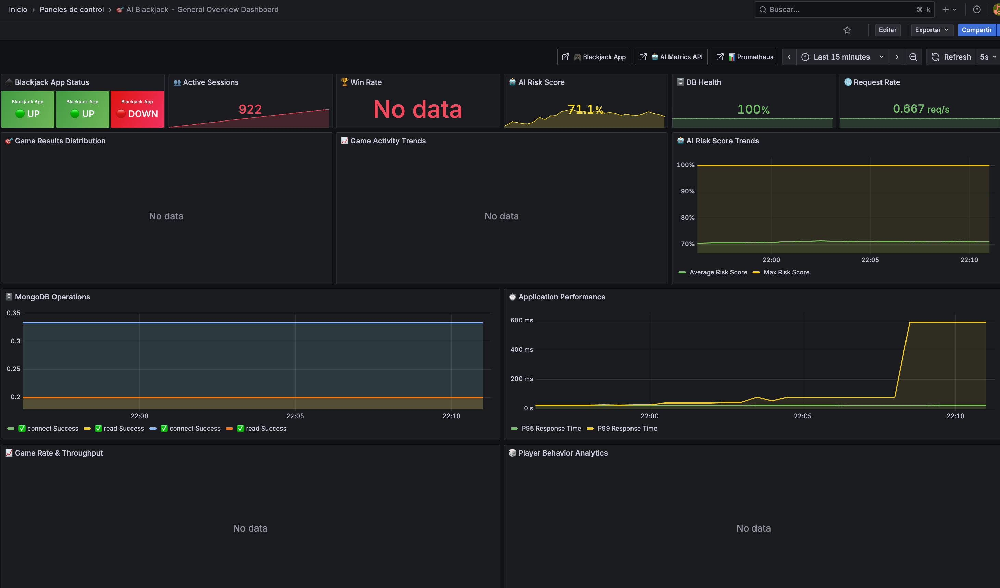

# 🤖 AI-Driven DevOps Solution
### AWS re:Invent 2025 - Supercharge DevOps with AI-driven observability

> **Transform your CI/CD pipeline with intelligent observability powered by multiple AI providers**

[](https://github.com/features/actions)
[](https://aws.amazon.com/bedrock/)
[](https://www.anthropic.com/)
[](https://openai.com/)
[](https://kubernetes.io/)
[](https://hub.docker.com/)
[](https://opensource.org/licenses/MIT)

<div align="center">

**🚀 Intelligent deployment gates • 🧠 Multi-provider AI analysis • 📊 Real-time health scoring • 🔒 Production-ready security**



[🎯 Quick Start](docs/guides/QUICK_START.md) • [🧪 Try Demo](docs/guides/DEMO_ENVIRONMENT.md) • [📋 Examples](examples/) • [⚙️ Architecture](docs/architecture/REPOSITORY_STRUCTURE.md)

</div>

## 🌟 Overview

This AI-Driven DevOps solution revolutionizes deployment pipelines by providing intelligent analysis and decision-making capabilities. Built for **AWS re:Invent 2025**, it demonstrates how Generative AI transforms DevOps and SRE practices with **modular architecture** and **multiple AI providers** (AWS Bedrock, Claude, OpenAI).

### 🎯 Key Features

- **🧠 Intelligent Failure Analysis** - AI explains failures with context and root cause detection
- **🤖 Multi-Provider AI Support** - AWS Bedrock, Claude, and OpenAI integration
- **☸️ Kubernetes Native** - Direct API integration with Python client + kubectl fallback
- **📊 Health Scoring System** - 360-degree system assessment (0-100 scale)
- **🔄 CI/CD Integration** - GitHub Actions workflows with deployment gates
- **📱 Smart Notifications** - Telegram alerts with AI model attribution
- **🐳 Lightweight Container** - Alpine-based Docker image (~50MB)

## 🏗️ Architecture

<div align="center">
  
</div>

### 🔄 Sequential Flow

<div align="center">
  
</div>

The solution integrates AI providers with Kubernetes observability systems through a modular architecture. The sequential flow shows the complete process from deployment trigger to AI-powered decision making.


**Key Features:**
- **🧠 Multi-Provider AI** - Seamless switching between AWS Bedrock, Claude, and OpenAI
- **📊 Intelligent Health Scoring** - AI-weighted analysis with historical context
- **🔄 Real-time Processing** - Live Kubernetes metrics and event correlation
- **🎯 Smart Decision Making** - Context-aware deployment recommendations

See [detailed architecture documentation](docs/architecture/REPOSITORY_STRUCTURE.md) for complete technical details including data flow diagrams and security architecture.

## 📱 Smart Notifications

Get intelligent alerts with context and actionable insights directly in Telegram:

<div align="center">

<table>
<tr>
<td align="center">
<h3>✅ Successful Deployment</h3>

</td>
<td align="center">
<h3>🚨 Critical Issues Detected</h3>

</td>
</tr>
</table>

</div>

## 🔍 AI Analysis in Action

See how the AI-driven analysis works in real GitHub Actions workflows:

<div align="center">

<table>
<tr>
<td align="center">
<h3>✅ Successful Analysis</h3>

</td>
<td align="center">
<h3>🚨 Issues Detected</h3>

</td>
</tr>
</table>

</div>

## 📊 Grafana Dashboards

Monitor your AI-driven DevOps metrics with beautiful Grafana visualizations:

<div align="center">

<table>
<tr>
<td align="center">
<h3>📈 System Overview Dashboard</h3>

</td>
<td align="center">
<h3>🎯 AI Health Scoring Dashboard</h3>

</td>
</tr>
</table>

</div>

## 📚 Documentation

**[📖 Complete Documentation Index](docs/INDEX.md)** - Full documentation catalog

### 🚀 Getting Started (Start Here!)
- **[Quick Start Guide](docs/guides/QUICK_START.md)** ⭐ - 5-minute setup with examples
- **[Demo Environment](docs/guides/DEMO_ENVIRONMENT.md)** - Try it with real K8s workloads
- **[Workflow Templates](examples/)** - 5 ready-to-use GitHub Actions workflows

### 🤖 AI Agent & Tools (For Developers)
- **[AI Agent Details](docs/guides/AGENT_DETAILS.md)** ⭐ - Agent architecture, prompts, invocation code
- **[Tools Reference](docs/guides/TOOLS_REFERENCE.md)** ⭐ - Complete tool documentation with examples
- **[Tool Pattern Compliance](docs/guides/TOOL_PATTERN_COMPLIANCE.md)** - LLM agent pattern verification
- **[Health Scoring System](docs/guides/HEALTH_SCORING.md)** - Deterministic formula and calculations

### 🏗️ Architecture & Configuration
- **[Repository Structure](docs/architecture/REPOSITORY_STRUCTURE.md)** - Code organization and data flow
- **[Multi-Agent Roadmap](docs/architecture/MULTI_AGENT_ROADMAP.md)** 🔮 - Future architecture evolution
- **[Logging Configuration](docs/guides/LOGGING_CONFIGURATION.md)** - Logger setup (macOS compatible)

### 📊 Technical Review & Quality
- **[Technical Review Response](docs/TECHNICAL_REVIEW_RESPONSE.md)** ⭐ - Complete response to all feedback
- **[Improvements Summary](docs/IMPROVEMENTS_SUMMARY.md)** - Detailed changes made
- **[Technical Review Checklist](docs/TECHNICAL_REVIEW_CHECKLIST.md)** - Verification and metrics

## 🚀 Quick Start

### Basic Usage

```yaml
- name: 🤖 AI Deployment Gate
  uses: roxsross/ai-driven-devops@main
  with:
    model-provider: 'openai'
    openai-api-key: ${{ secrets.OPENAI_API_KEY }}
    namespace: 'production'
    health-threshold: '85'
    blocking-mode: 'true'
```

### AI Provider Options

| Provider | Best For | Setup |
|----------|----------|-------|
| **AWS Bedrock** | Enterprise environments | AWS credentials required |
| **Claude** | Advanced reasoning | API key required |
| **OpenAI** | General purpose | API key required |

For detailed setup instructions and complete examples, see the [Quick Start Guide](docs/guides/QUICK_START.md).

## 🎮 Workflow Examples

We provide **5 ready-to-use workflow templates** in the [`examples/`](./examples/) directory:

| Template | Purpose | Best For |
|----------|---------|----------|
| [Basic Simulation](./examples/basic-simulation-template.yml) | Testing without infrastructure | Getting Started |
| [Deployment Gate](./examples/deployment-gate-template.yml) | Production deployment protection | Production Safety |
| [Pull Request Check](./examples/pr-check-template.yml) | Early feedback on code changes | Code Review |
| [Post-Deployment Validation](./examples/post-ai-check-template.yml) | Validate deployment success | Deployment Verification |
| [Scheduled Monitoring](./examples/scheduler-template.yml) | Continuous health surveillance | Continuous Monitoring |

## ✨ Key Highlights

- **🏗️ Modular Architecture** - Clean, maintainable code structure
- **🚀 Kubernetes Native** - Direct API integration with Python client
- **🤖 Multi-Provider AI** - Seamless switching between Bedrock, Claude, OpenAI
- **🐳 Alpine Docker** - Lightweight container 
- **📱 Smart Notifications** - Telegram alerts with AI model attribution
- **🔍 Enhanced Detection** - Real-time pod log analysis with pattern recognition

## 🧪 Demo Environment

Try the solution with a complete Kubernetes demo environment. See the [Demo Environment Guide](docs/guides/DEMO_ENVIRONMENT.md) for detailed setup instructions.

```bash
# Quick demo setup
./k8s-demo/run-demo.sh deploy
./k8s-demo/run-demo.sh healthy    # Test healthy scenario
./k8s-demo/run-demo.sh cleanup
```

## 📊 Understanding the Output

The AI analysis provides structured outputs for integration with your CI/CD pipeline:

```yaml
outputs:
  health-score: "87"           # 0-100 health score
  recommendation: "deploy"     # deploy, block, or deploy_with_warnings
  critical-issues: "0"         # Number of critical issues found
  analysis-summary: "System is healthy..."
```

For detailed health scoring information, see the [Health Scoring Guide](docs/guides/HEALTH_SCORING.md).

## ⚙️ Configuration

### Key Parameters

| Parameter | Description | Default |
|-----------|-------------|---------|
| `model-provider` | AI provider (bedrock, claude, openai) | `bedrock` |
| `health-threshold` | Minimum health score (0-100) | `80` |
| `blocking-mode` | Can block deployments | `true` |
| `namespace` | Kubernetes namespace | `default` |

For complete configuration options, see the [Quick Start Guide](docs/guides/QUICK_START.md).

## 🔧 Local Development

```bash
# Clone and setup
git clone https://github.com/roxsross/aws-ai-driven-devops-actions.git
cd aws-ai-driven-devops-actions
python -m venv venv
source venv/bin/activate
pip install -r requirements.txt

# Configure and test
cp .env.example .env
# Edit .env with your settings
python main.py
```

For detailed development setup, see the [Quick Start Guide](docs/guides/QUICK_START.md).

