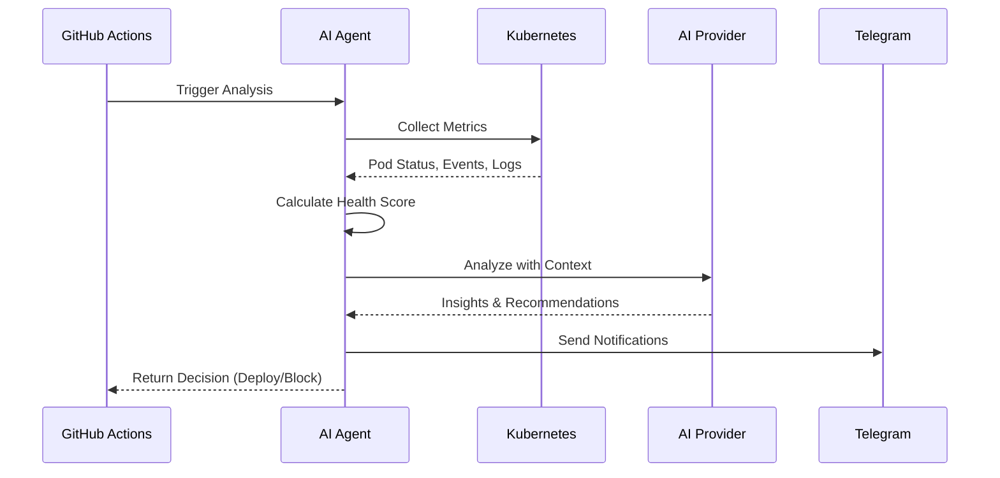
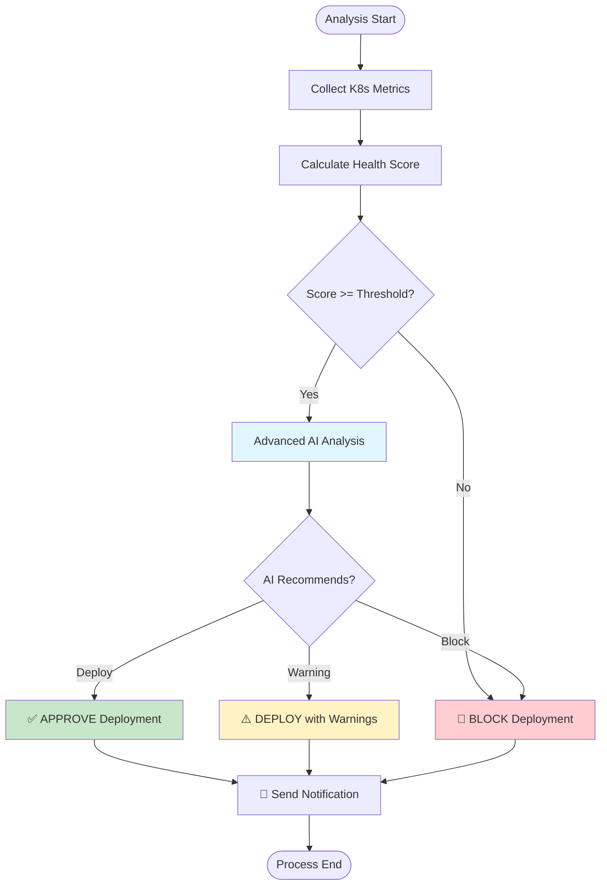
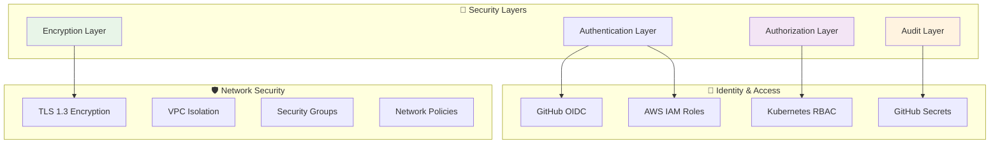

# 🏗️ Repository Structure & How It Works

## 📁 Project Architecture

```
ai-driven-devops/
├── 🚀 main.py                            # Application entry point with Strands AI agent
├── 📦 src/                               # Modular source code architecture
│   ├── ⚙️ config/                        # Environment and settings management
│   │   ├── __init__.py
│   │   └── settings.py                   # Configuration loader and validation
│   ├── 🤖 models/                        # Multi-provider AI model implementations
│   │   ├── __init__.py
│   │   └── ai_models.py                  # Bedrock, Claude, OpenAI integrations
│   ├── 🔍 analyzers/                     # System health analysis engines
│   │   ├── __init__.py
│   │   ├── kubernetes.py                 # K8s cluster analysis (API + kubectl)
│   │   └── prometheus.py                 # Metrics collection and analysis
│   ├── 📱 notifications/                 # Smart notification system
│   │   ├── __init__.py
│   │   └── telegram.py                   # Telegram bot with AI context
│   ├── 🛠️ utils/                         # Helper functions and utilities
│   │   ├── __init__.py
│   │   └── helpers.py                    # GitHub Actions outputs, logging
│   └── 🔧 tools/                         # Observability and analysis tools
│       ├── __init__.py
│       ├── observability.py              # Health scoring, predictions
│       └── prometheus_tools.py           # Prometheus query helpers
├── 📋 examples/                          # Ready-to-use workflow templates
│   ├── 🎭 basic-simulation-template.yml  # Testing without infrastructure
│   ├── 🚀 deployment-gate-template.yml   # Production deployment protection
│   ├── 🔍 pr-check-template.yml          # Early feedback on PRs
│   ├── ✅ post-ai-check-template.yml     # Post-deployment validation
│   └── ⏰ scheduler-template.yml          # Continuous health surveillance
├── 🧪 k8s-demo/                          # Complete demo environment (requires K8s cluster)
│   ├── nginx/                            # Sample nginx application
│   ├── nginx-grafana-dashboard/          # Grafana dashboard configs
│   ├── nginx-k6/                         # Load testing scripts
│   ├── nginx-prometheus/                 # Prometheus monitoring setup
│   └── run-demo.sh                       # Demo orchestration script
├── 📊 docs/                              # Documentation and diagrams
│   └── images/                           # Architecture diagrams
│       ├── diagram-ai-driven-high-level.png
│       └── diagram-ai-driven-sequential.png
├── 🔧 .github/workflows/                 # CI/CD automation
│   └── ai-gate-image.yml                 # Build, test & deploy pipeline
├── 🔧 .env.example                       # Complete configuration template
├── 🐳 Dockerfile                         # Multi-arch Alpine container (~50MB)
├── ⚙️ action.yml                         # GitHub Action definition with all inputs
├── 📦 requirements.txt                   # Python dependencies
├── 🚀 entrypoint.sh                      # Container entrypoint with AWS/EKS setup
└── 📋 CHANGELOG.md                       # Version history and updates
```

## 🔄 How the Repository Works

### 1. **🚀 Entry Point (`main.py`)**
The main application orchestrates the entire AI-driven analysis process:

```python
# Core workflow
def main():
    # 1. Load configuration from environment
    config = load_configuration()
    
    # 2. Initialize AI model (Bedrock/Claude/OpenAI)
    ai_model = create_ai_model(config.model_provider)
    
    # 3. Create AI agent with observability tools
    agent = create_ai_agent(ai_model, observability_tools)
    
    # 4. Analyze system health
    analysis_result = agent.analyze_system_health()
    
    # 5. Make deployment decision
    decision = make_deployment_decision(analysis_result)
    
    # 6. Send notifications and set outputs
    notify_stakeholders(decision)
    set_github_outputs(decision)
```

### 2. **📦 Source Code Modules (`src/`)**

**🤖 AI Models (`src/models/ai_models.py`)**
- Unified interface for multiple AI providers
- Dynamic model switching based on configuration
- Error handling and fallback mechanisms

```python
class AIModelFactory:
    @staticmethod
    def create_model(provider: str):
        if provider == "bedrock":
            return BedrockModel(model_id="amazon.nova-pro-v1:0")
        elif provider == "claude":
            return ClaudeModel(model_id="claude-3-5-sonnet-20241022")
        elif provider == "openai":
            return OpenAIModel(model_id="gpt-4")
```

**🔍 Analyzers (`src/analyzers/`)**
- `kubernetes.py`: Direct K8s API integration + kubectl fallback
- `prometheus.py`: Metrics collection and trend analysis
- Real-time health assessment and anomaly detection

**🔧 Tools (`src/tools/`)**
- `observability.py`: Health scoring algorithms, predictions
- `prometheus_tools.py`: Query helpers and metric correlation
- Advanced analytics and pattern recognition

**📱 Notifications (`src/notifications/`)**
- Smart alerts with AI context and recommendations
- Multi-channel support (Telegram, Slack, Email)
- Contextual information with pipeline details

### 3. **📋 Workflow Templates (`examples/`)**

Ready-to-use GitHub Actions workflows for different scenarios:

| Template | Purpose | When to Use | Blocking |
|----------|---------|-------------|----------|
| **🎭 Basic Simulation** | Test AI without infrastructure | Learning, testing | ❌ No |
| **🚀 Deployment Gate** | Production deployment protection | Before prod deploys | ✅ Yes |
| **🔍 PR Check** | Early feedback on code changes | Code review process | ❌ No |
| **✅ Post-AI Check** | Validate deployment success | After deployments | ❌ No |
| **⏰ Scheduler** | Continuous health monitoring | Proactive monitoring | ❌ No |

### 4. **🧪 Demo Environment (`k8s-demo/`)**

> **⚠️ Prerequisites**: To run this demo, you must have access to a Kubernetes cluster (AWS EKS or local cluster like minikube, kind, k3s)

Complete demonstration setup with:
- **Nginx Application**: Sample microservice with health endpoints
- **Monitoring Stack**: Prometheus + Grafana integration
- **Load Testing**: K6 scripts for realistic traffic simulation
- **Orchestration**: Automated demo scenarios (healthy, pressure, critical, recovery)

```bash
# Run complete demo
./k8s-demo/run-demo.sh full-demo

# Run specific scenarios
./k8s-demo/run-demo.sh healthy    # Healthy system scenario
./k8s-demo/run-demo.sh pressure   # Resource pressure scenario
./k8s-demo/run-demo.sh critical   # Critical failure scenario
./k8s-demo/run-demo.sh recovery   # Recovery scenario
```

### 5. **🔧 CI/CD Pipeline (`.github/workflows/`)**

Automated build, test, and deployment pipeline:

```yaml
# Build → Test → Deploy workflow
jobs:
  build:           # Build multi-arch Docker image
  smoke-test:      # Quick functionality validation
  ai-gate-example: # Test AI providers (Bedrock, Claude, OpenAI)
  scenario-tests:  # Test different health thresholds
  build-summary:   # Consolidated reporting
```

## 🎯 Key Integration Points

### GitHub Actions Integration
```yaml
- name: 🤖 AI Deployment Gate
  uses: roxsross/ai-driven-devops@main
  with:
    model-provider: 'bedrock'
    health-threshold: '85'
    blocking-mode: 'true'
    namespace: 'production'
```

### Kubernetes Integration
```python
# Direct API integration
from kubernetes import client, config
api = client.CoreV1Api()
pods = api.list_namespaced_pod(namespace)

# kubectl fallback for complex operations
subprocess.run(['kubectl', 'describe', 'pod', pod_name])
```

### AI Provider Integration
```python
# Multi-provider support with unified interface
response = ai_model.invoke(
    prompt=analysis_prompt,
    context=system_metrics,
    tools=observability_tools
)
```

## 🔄 Execution Flow

1. **Trigger**: GitHub Actions workflow starts
2. **Initialize**: Load config, create AI model and agent
3. **Collect**: Gather K8s metrics, events, and logs
4. **Analyze**: AI processes data with observability tools
5. **Score**: Calculate comprehensive health score (0-100)
6. **Decide**: Make deployment decision (APPROVE/BLOCK/WARN)
7. **Notify**: Send contextual alerts to configured channels
8. **Output**: Return decision and metrics to GitHub Actions

## 🛠️ Development Workflow

### Local Development
```bash
# 1. Clone and setup
git clone https://github.com/roxsross/ai-driven-devops.git
cd ai-driven-devops
python -m venv venv
source venv/bin/activate  # or venv\Scripts\activate on Windows
pip install -r requirements.txt

# 2. Configure environment
cp .env.example .env
# Edit .env with your settings

# 3. Test locally
python main.py  # Run with simulation mode

# 4. Test with demo environment
./k8s-demo/run-demo.sh deploy
```

### Contributing
```bash
# 1. Create feature branch
git checkout -b feature/new-functionality

# 2. Make changes and test
python main.py  # Local testing
./k8s-demo/run-demo.sh healthy  # Integration testing

# 3. Commit and push
git commit -m "feat: add new functionality"
git push origin feature/new-functionality

# 4. Create PR - CI/CD will automatically test
```

## 📊 Monitoring and Observability

The repository includes comprehensive monitoring:

- **Health Metrics**: Real-time system health scoring
- **Performance Tracking**: Response times, resource usage
- **AI Analytics**: Model performance and decision accuracy
- **Pipeline Metrics**: Deployment success rates, failure patterns
- **Custom Dashboards**: Grafana dashboards for visualization

## 🔐 Security and Best Practices

- **Least Privilege**: Minimal required permissions
- **Secret Management**: GitHub Secrets for sensitive data
- **Container Security**: Alpine-based images, vulnerability scanning
- **Network Security**: TLS encryption, secure communications
- **Audit Trail**: Complete logging of all decisions and actions
### 🔄
 **Data Flow and Processing**

#### **📈 Health Analysis Flow**



#### **🎯 Decision Making Process**



### 🔐 **Security Architecture**

#### **🛡️ Security Layers**

